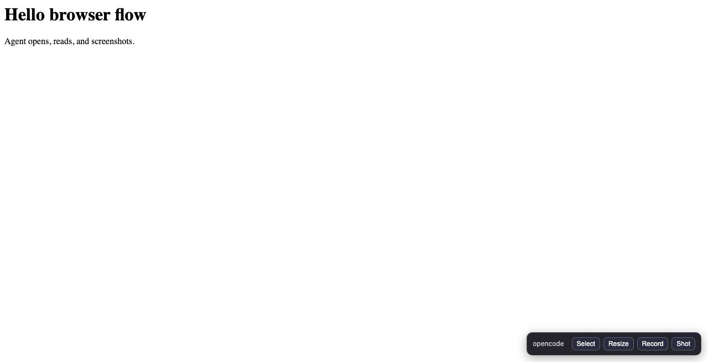
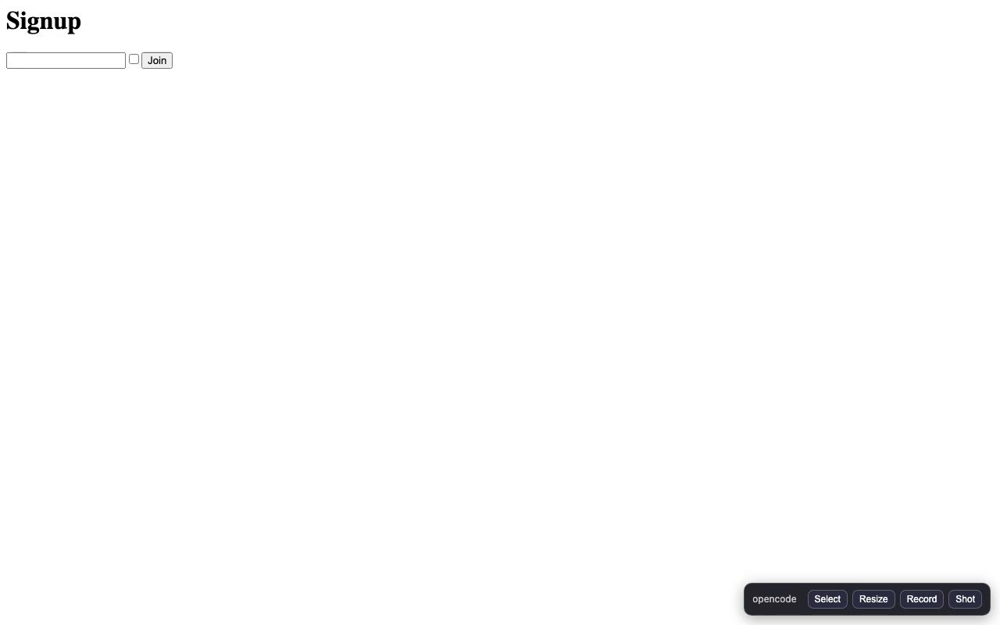

# Demos

Real recordings of the **browser flow** plugin driving headless Chromium —
produced by `bun docs/record-demo.ts` (see `record-demo.ts`; stills in
`frames-demo1/` and `frames-demo2/`).

## 1. Open + flow transcript

`flow_start` → open a page → `read` → `screenshot` → mobile `resize` →
desktop `resize` → `flow_stop` (flow folder + chat-ready transcript).

[](demo-open-flow.mp4)


> If the player above doesn't render, [download/watch demo-open-flow.mp4](demo-open-flow.mp4).

## 2. Interact with a form

Open a form → `type` → `fill` → mobile `resize` → `click` → back to desktop.
Every step ends with a screenshot, so the agent always sees the result.

[](demo-interact.mp4)


> If the player above doesn't render, [download/watch demo-interact.mp4](demo-interact.mp4).

## Re-record

```bash
bun docs/record-demo.ts
# then re-encode:
ffmpeg -y -framerate 1 -i docs/frames-demo1/frame-%03d.jpg \
  -vf "scale=trunc(iw/2)*2:trunc(ih/2)*2" -c:v libx264 -pix_fmt yuv420p \
  docs/demo-open-flow.mp4
ffmpeg -y -framerate 1 -i docs/frames-demo2/frame-%03d.jpg \
  -vf "scale=trunc(iw/2)*2:trunc(ih/2)*2" -c:v libx264 -pix_fmt yuv420p \
  docs/demo-interact.mp4
```
